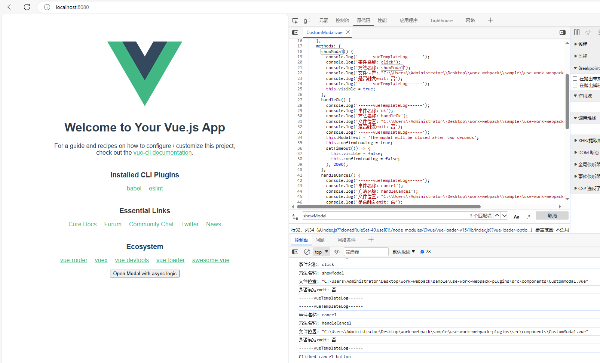

# work-webpack

工作中开发的 webpack plugins or loader

## loader

### VueTemplateLog

给 `template` 模版预发中 `click` 方法增加 `log`。（目前有性能问题，且不支持 `vue3` ）

在一个比较庞大的项目中想要找出相应的代码比较费劲的时候可以考虑使用该 `loader`。

### Loader 使用案例

#### vueTemplateLog

该 `loader` 会动态生成 `log`。

```ts
module.exports = defineConfig({
  transpileDependencies: true,

  chainWebpack: config => {
    config.module
      .rule('vue')
      .test(/\.vue$/)
      .use('vue-template-log')
      .loader('work-webpack/dist/vueTemplateLog');
  }
});
```



## plugins

### ModulesAnalysis

用于分析项目中 `node_modules` 使用的次数与方式。

分析出项目中每个包的使用情况，使开发者能够分析哪些包可以更进一步的做优化。

#### options

|        名称         |    类型    | 描述                             | 默认值                                      |
| :-----------------: | :--------: | :------------------------------- | :------------------------------------------ |
|  **`acceptType`**   | `{Array}`  | 文件类型                         | 默认值: `['vue', 'js', 'jsx', 'tsx', 'ts']` |
| **`ignoreModules`** | `{Array}`  | 需要被忽略的 node_module 名称    | 默认值: `['vue', 'vue-router']`             |
|  **`outputType`**   | `{String}` | 输出方式, 支持 `json` `markdown` | 默认值: `'json'`                            |

### SafeDeleteFile

用于分析项目中有哪些文件没有被使用，也许可以安全删除。

在老项目不停的迭代，有些代码或文件也许早已没有作用，但开发者不知道哪些文件可以安全删除。那么你可以试试这个插件！

#### options

|       名称       |         类型         | 描述                             | 默认值                       |
| :--------------: | :------------------: | :------------------------------- | :--------------------------- |
| **`folderPath`** |      `{String}`      | 文件路径                         | 默认值: `cli`执行目录下`src` |
|   **`ignore`**   | `{String}` `{Array}` | 需要被忽略文件夹或文件           | 默认值: []                   |
| **`outputType`** |      `{String}`      | 输出方式, 支持 `json` `markdown` | 默认值: `'json'`             |

### Plugins 使用案例

### SafeDeleteFile ModulesAnalysis

```
cd sample/use-work-webpack-plugins

npm i && npm run build

```

构建后会生成 `modulesAnalysis.json` 和 `safeDeleteFile.json` 两个文件

```js
// safeDeleteFile.json
[
  '/src/assets/aleksandr-popov-Hkrp734cElQ-unsplash.jpg',
  '/src/assets/devon-hawkins-YW_xD_j50UI-unsplash.jpg',
  '/src/assets/neom-JZerhwPHiBI-unsplash.jpg',
  '/src/components/CustomModal.vue',
  '/src/not-use.js'
];
```

```js
// modulesAnalysis.json
[
  ({ name: 'axios', total: 1, files: [{ filePath: '/src/components/HelloWorld.vue', useType: 'import' }] },
  { name: 'dayjs', total: 1, files: [{ filePath: '/src/components/HelloWorld.vue', useType: 'require' }] },
  { name: 'ant-design-vue', total: 1, files: [{ filePath: '/src/main.js', useType: 'require' }] })
];
```
